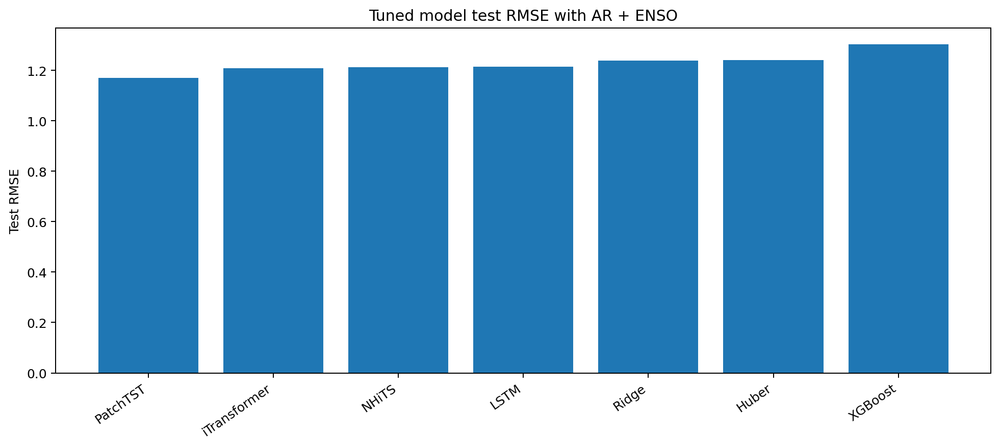
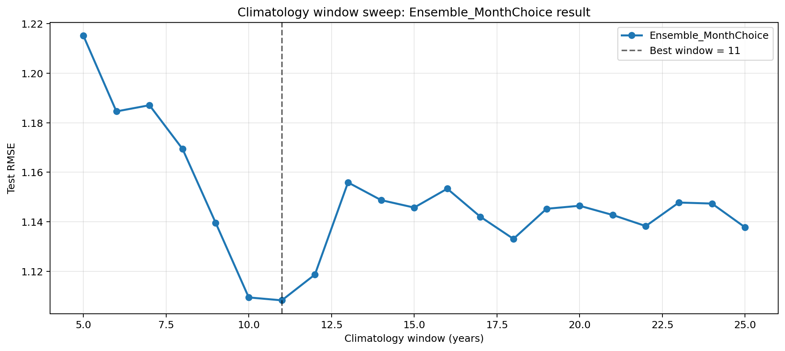

# NOAA Temperature Anomaly Forecasting

**Classical machine learning vs deep sequence models vs transformer-style forecasters for monthly climate anomaly prediction.**

This project mainly studies one-month-ahead (H=1) NOAA temperature anomaly forecasting, asking whether increasingly complex models actually improve forecasts and whether those gains survive comparison against a simple climatology baseline.


---

## The Research Question

Which model family works best for monthly NOAA temperature anomaly forecasting: classical machine learning, deep sequence models, or transformer-style forecasters; how much can feature selection, tuning, and residual design improve them; and can they beat a simple climatology baseline?

The project follows a staged experiment path instead of a one-off leaderboard. Each notebook fixes one part of the forecasting design, carries the best-supported choice forward, and checks whether the extra complexity earns its place.


|                    |                                                            |                |                                                        |
| ------------------ | ---------------------------------------------------------- | -------------- | ------------------------------------------------------ |
| **Target**         | Monthly NOAA temperature anomaly                           | **Evaluation** | Chronological train / validation / test split          |
| **Model families** | Ridge, Huber, XGBoost, LSTM, PatchTST, iTransformer, NHiTS | **Baseline**   | Simple climate-memory / rolling climatology benchmarks |


---


## Headline Result


|                             |                            |                                                                      |
| --------------------------- | -------------------------- | -------------------------------------------------------------------- |
| **Final H=1 RMSE** `1.1013` | **Final H=1 MAE** `0.8245` | **Improvement vs Notebook 05 PatchTST** `-0.0692 RMSE` `-0.0982 MAE` |


The final H=1 fixed seasonal residual strategy beat the best global single model, `Residual_MLP`, and improved over the tuned Notebook 05 PatchTST result. The answer is deliberately nuanced: transformers were strong early, but the best final H=1 system came from a better forecasting design, not simply from choosing the largest or most modern model.



---


## What The Experiments Found


|                                                                                                                                      |                                                                                                                                                  |
| ------------------------------------------------------------------------------------------------------------------------------------ | ------------------------------------------------------------------------------------------------------------------------------------------------ |
|  |  |
| **Model family comparison** PatchTST led the tuned H=1 research set, with iTransformer, NHiTS, and LSTM also competitive.            | **Design mattered** Residual modeling around rolling climatology improved the problem framing and reduced held-out error.                        |


Key takeaways:

- Transformer-style models were often strong, especially PatchTST and iTransformer.
- Classical models remained useful as stable baselines and robustness checks.
- Deep learning did not win by default; gains depended on feature set, target design, and how the model was evaluated.
- The biggest lift came from combining model selection with residual climatology design.

---


## Experiment Arc


| Notebook                                 | Question                                                                          | Output                        |
| ---------------------------------------- | --------------------------------------------------------------------------------- | ----------------------------- |
| 01_reference_backtest.ipynb              | Can the full pipeline beat the built-in 60/40 persistence and last-year baseline? | Reference benchmark           |
| 02_feature_ablation.ipynb                | Which climate inputs help: AR, teleconnections, SST, ENSO?                        | Feature set selection         |
| 03_training_and_selection_strategy.ipynb | Do recency weighting and month grouping improve selection?                        | Training and selection policy |
| 04_temporal_feature_tuning.ipynb         | Which AR and ENSO lag structures work best?                                       | Temporal feature design       |
| 05_model_hypertuning.ipynb               | Which tuned model family performs best at H=1?                                    | Model-family comparison       |
| 06_climatology_residual_design.ipynb     | Does residual forecasting over climatology improve the system?                    | Residual design choice        |
| 07_horizon_transfer.ipynb                | As a smaller final check, do selected H=1 settings transfer to H=2, H=3, H=6, and H=12? | Horizon robustness check      |


The final narrative is in `[case_analysis_final.md](case_analysis_final.md)`.

---


## Repository Map

```text
.
|-- experiment_notebooks/              Research notebooks 01-07
|-- experiment_notebooks/Experiment_Images_For_Case_Analysis/
|                                      Figures used in the final analysis
|-- notebooks_outputs/                 Selected CSV experiment outputs
|-- src/forecaster/                    Reusable data, model, evaluation code
|-- app.py, modeling.py                Flask app and app-facing forecast entrypoint
|-- templates/, static/                Browser UI
|-- tools/prepush_check.py             One-command GitHub readiness check
|-- case_analysis_final.md             Final written interpretation
`-- Dockerfile                         Optional containerized runtime
```

---


## Data Policy

Large NOAA inputs are intentionally not tracked in Git. The repository expects local data in this ignored layout:

```text
noaa_raw_data/
  nclimgrid_tavg.nc
  nina34.anom.csv
  sst_cache/
    ersst.v6.YYYYMM.nc
```

The `.gitignore` excludes `noaa_raw_data/`, NetCDF files, ENSO CSV inputs, SST caches, run artifacts, notebook checkpoints, and local model output.

Official source locations:


| Local file or folder           | Source                                                                                                                                                                                                        |
| ------------------------------ | ------------------------------------------------------------------------------------------------------------------------------------------------------------------------------------------------------------- |
| `nclimgrid_tavg.nc`            | NOAA/NCEI nClimGrid monthly direct download: [https://www.ncei.noaa.gov/pub/data/nidis/indices/nclimgrid-monthly/base-files/](https://www.ncei.noaa.gov/pub/data/nidis/indices/nclimgrid-monthly/base-files/) |
| `sst_cache/ersst.v6.YYYYMM.nc` | NOAA PSL ERSSTv6 dataset page: [https://www.psl.noaa.gov/data/gridded/data.noaa.ersst.v6.html](https://www.psl.noaa.gov/data/gridded/data.noaa.ersst.v6.html)                                                 |
| `nina34.anom.csv`              | NOAA PSL monthly Niño 3.4 time series: [https://psl.noaa.gov/data/timeseries/month/Nino34/](https://psl.noaa.gov/data/timeseries/month/Nino34/)                                                               |


The ENSO loader expects a CSV with a date-like column such as `date`, `time`, `datetime`, or `month`, plus a value column such as `nino34`, `nina34`, `anom`, `anomaly`, `value`, `enso`, or `index`.

---


## Running The Project

**Install dependencies**

```powershell
py -3.11 -m venv .venv
.\.venv\Scripts\Activate.ps1
python -m pip install --upgrade pip
pip install -r requirements.txt
```


**Run the Flask app**

By default, the app expects local data under `noaa_raw_data/`.

```powershell
$env:TAVG_FILE = ".\noaa_raw_data\nclimgrid_tavg.nc"
$env:SST_DIR = ".\noaa_raw_data\sst_cache"
$env:ENSO_CSV = ".\noaa_raw_data\nina34.anom.csv"
$env:RUNS_DIR = ".\runs"

$env:FLASK_APP = "app"
$env:FLASK_DEBUG = "1"
py -3.11 -m flask run --host=127.0.0.1 --port=5000
```

Then open `http://localhost:5000`.

Useful endpoints:

```text
GET  /         -> web interface
GET  /health   -> health check
GET  /models   -> available models, seasons, and modes
POST /run      -> execute a forecast run
```


**Example API request**

```powershell
$body = @{
  mode = "single"
  model_name = "lstm"
  horizon = 1
  K = 10
  pc_lags = @(1,2,3,6,12)
  y_lags = @(1,2,3,6,12)
  sst_pc_lags = @(0,1,3,6,12)
  ar_lags = @(1,2,3,6,12,18,24)
  enso_lags = @(0)
  half_life_months = 48
  use_climatology_residual = $true
  climatology_years = 18
  tavg_file = ".\noaa_raw_data\nclimgrid_tavg.nc"
  sst_dir = ".\noaa_raw_data\sst_cache"
  enso_csv = ".\noaa_raw_data\nina34.anom.csv"
  runs_dir = ".\runs"
  use_enso = $true
  use_sst = $false
  use_teleconnections = $false
  use_qmap = $false
} | ConvertTo-Json

Invoke-RestMethod `
  -Method Post `
  -Uri "http://localhost:5000/run" `
  -ContentType "application/json" `
  -Body $body
```


**Run with Docker**

```powershell
docker build -t noaa-forecaster .

docker run --rm -p 5000:5000 `
  -e TAVG_FILE=/data/nclimgrid_tavg.nc `
  -e SST_DIR=/data/sst_cache `
  -e ENSO_CSV=/data/nina34.anom.csv `
  -e RUNS_DIR=/app/runs `
  -v "${PWD}\noaa_raw_data:/data" `
  noaa-forecaster
```


---


## Reproduce The Analysis

1. Place local NOAA data under `noaa_raw_data/`.
2. Run notebooks 01 through 07 in order.
3. Review selected CSV outputs in `notebooks_outputs/`.
4. Review the written summary in [case_analysis_final.md](case_analysis_final.md).

The notebooks save selected figures to `experiment_notebooks/Experiment_Images_For_Case_Analysis/`.

---


## Pre-Push Check

Run this before pushing:

```powershell
python tools/prepush_check.py
```

It validates notebook JSON, notebook error outputs, local machine path leakage, local data-file hygiene, `.gitignore` data exclusions, and unit tests. It does not rerun the expensive experiments.

During local work, when data files are still present or a notebook is actively running:

```powershell
python tools/prepush_check.py --skip-notebook 02_feature_ablation.ipynb --allow-local-data
```

---


## Tests

```powershell
$env:PYTHONPATH = ".\src"
pytest
```
