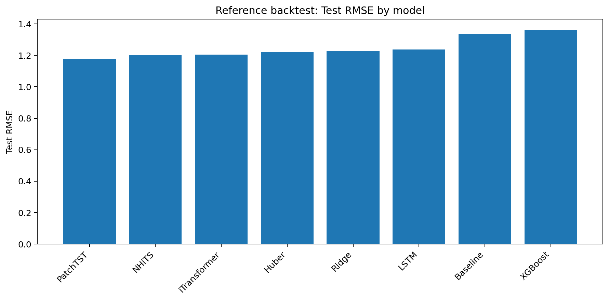
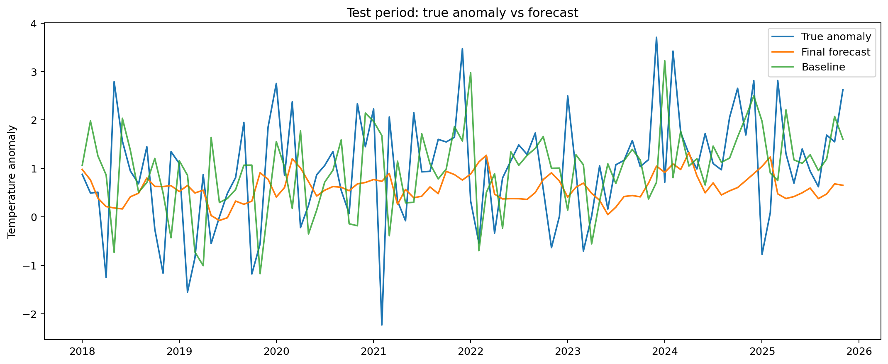
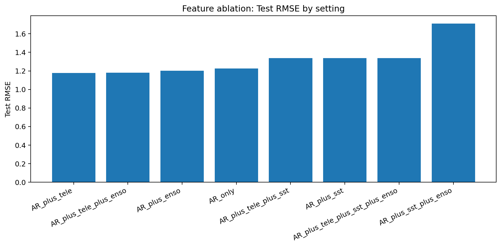
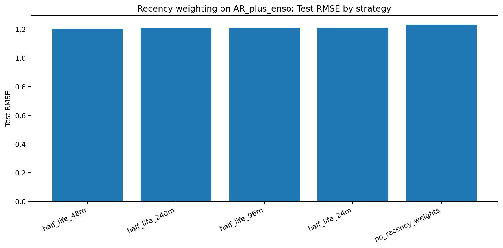
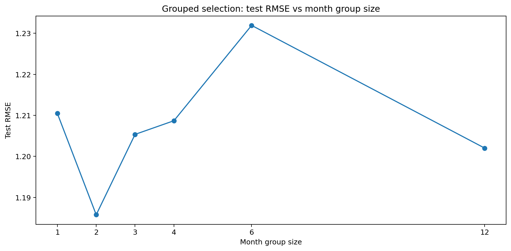
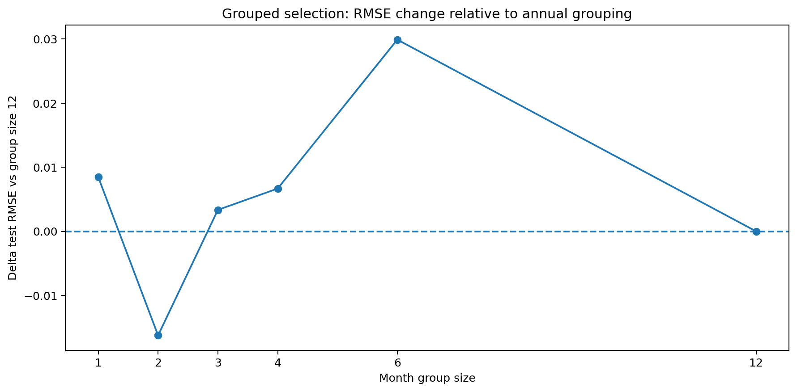
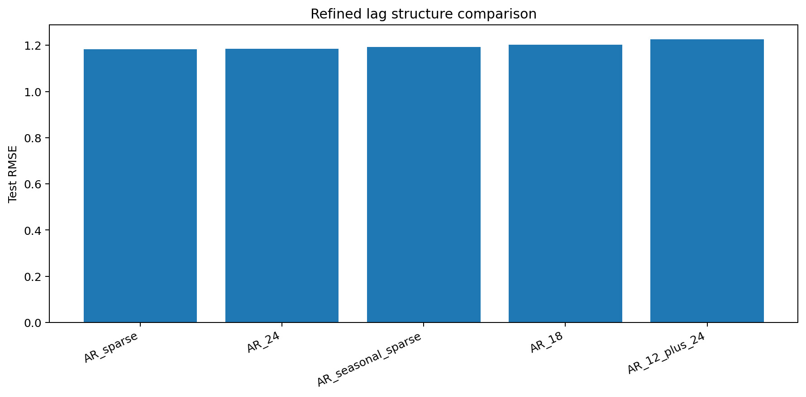
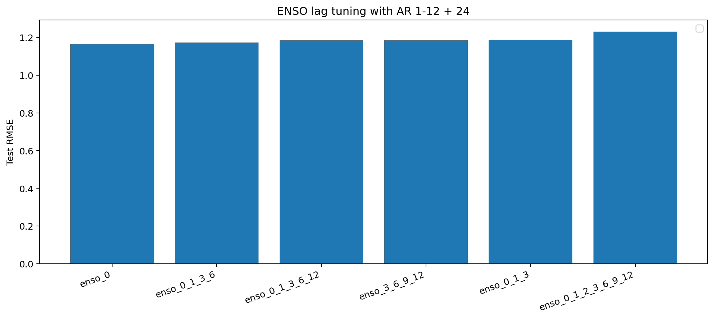
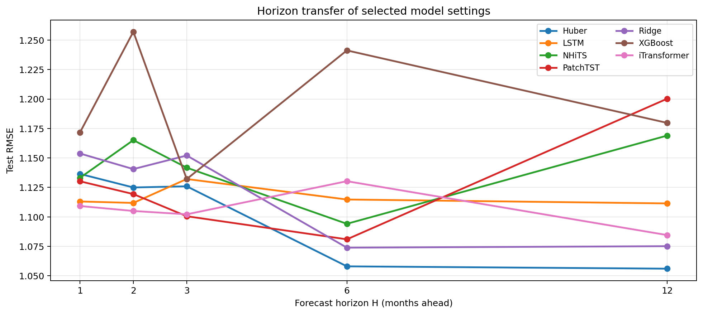

# Season-Aware Residual Forecasting for NOAA Temperature Anomalies

## Summary

This project evaluates whether a compact, time-series-appropriate model set can improve monthly NOAA temperature anomaly forecasts beyond climatology. The final experiment path uses chronological train/validation/test splits, a rolling climatology baseline, and a small retained model set:

- Ridge
- Huber
- XGBoost
- LSTM
- PatchTST
- iTransformer
- NHiTS

The goal is to test whether simple residual models, nonlinear tabular models, recurrent sequence models, PatchTST-style transformers, inverted transformers, or N-HiTS-style models provide stable gains over climatology, and whether the extra complexity is justified for this NOAA anomaly application.

The main experiments are one-month-ahead (H=1) forecasts. A smaller final horizon-transfer run compares the selected H=1 settings across H=2, H=3, H=6, and H=12 as a robustness check, not as the central experiment. The detailed results below show that the strongest model family depends on how the forecasting problem is framed.

## Evaluation Design

The notebooks use chronological splits rather than random shuffling. Validation is used for feature choices, weighting choices, lag choices, model settings, and month-group decisions. Test results are reserved for final evaluation.

Figures are generated by the notebooks and saved under:

`experiment_notebooks/Experiment_Images_For_Case_Analysis/`

Re-run notebooks `01-07` in order to regenerate the image files referenced below.

## Key Numerical Results

- Final fixed seasonal residual strategy: RMSE 1.1013, MAE 0.8245.
- Best final global single model: Residual_MLP, RMSE 1.1067, MAE 0.8342.
- Best Notebook 05 tuned-model result: PatchTST, RMSE 1.1705, MAE 0.9226.
- Final residual-system improvement vs Notebook 05 PatchTST: -0.0692 RMSE and -0.0982 MAE, or about 5.9% lower RMSE and 10.6% lower MAE.
- Early research-set winner: PatchTST, RMSE 1.1780, MAE 0.9312, ahead of NHiTS at RMSE 1.1907 and iTransformer at RMSE 1.1918.
- Tuned transformer/deep research set: PatchTST led with RMSE 1.1705 and MAE 0.9226; iTransformer, NHiTS, and LSTM were all above RMSE 1.20.
- A smaller horizon-transfer check found that winners shifted by lead time: iTransformer at H=1 and H=2, PatchTST at H=3, and Huber at H=6 and H=12.

## Reference Backtest

The reference backtest establishes whether the pipeline can beat the built-in baseline before adding later design choices.

In the initial research-set backtest, PatchTST was the best test model with RMSE 1.1780 and MAE 0.9312, compared with NHiTS at RMSE 1.1907 and iTransformer at RMSE 1.1918. The baseline test result was RMSE 1.3371 and MAE 1.0011, so the best early transformer result improved RMSE by about 0.1591.

## Feature Ablation

Feature ablation tests whether external climate signals improve over autoregressive information alone. The key interpretation is whether added features produce stable improvements rather than isolated leaderboard wins.

The feature ablation did not reward adding every possible climate signal. AR plus teleconnection features produced the best test RMSE in that notebook at 1.1789, with AR plus teleconnection plus ENSO close behind at 1.1795. AR plus ENSO landed at 1.2020, AR-only at 1.2269, while SST-heavy variants either matched the baseline RMSE of 1.3371 or, for AR plus SST plus ENSO, degraded to RMSE 1.7090. Later notebooks therefore favored compact temporal/ENSO designs over broad feature accumulation.

## Training And Selection Strategy

Recency weighting tests whether recent observations should receive more influence during training. Grouped selection then asks whether model choice should happen globally, by broad month groups, or separately for each month.

Recency weighting was one of the clearest process wins: a 96-month half-life achieved RMSE 1.1468 and MAE 0.8892, compared with RMSE 1.2585 and MAE 0.9801 with no recency weighting. Grouped selection also mattered. Three-month seasonal groups gave the best grouped-selection result in that notebook at RMSE 1.1843 and MAE 0.9284, while choosing separately for every month was worse at RMSE 1.2297.

## Temporal Feature Tuning

The lag sweep and ENSO tuning stages narrow the temporal feature design. After the feature ablation, the project carries forward a compact AR + ENSO setup; SST PCs and teleconnection indices are not carried forward in the main pipeline because the later notebooks prioritize the simpler selected feature scope.

The AR lag sweep selected a sparse memory structure. AR lags at 1, 2, 3, 6, 12, 18, and 24 months reached RMSE 1.1836 with PatchTST, narrowly ahead of a 24-lag iTransformer run at RMSE 1.1861. ENSO lag tuning then found that current ENSO alone was strongest in the carried-forward setup, with RMSE 1.1632 and MAE 0.9249; wider ENSO lag bundles ranged from RMSE 1.1721 to 1.2300.

## Model Hypertuning

The tuned model comparison is limited to the retained research set. This keeps the analysis focused on model roles rather than a large, noisy leaderboard.

Within the retained research set, PatchTST had the best tuned H=1 test result at RMSE 1.1705 and MAE 0.9226. iTransformer followed at RMSE 1.2082, NHiTS at 1.2138, LSTM at 1.2155, Ridge at 1.2401, Huber at 1.2412, and XGBoost at 1.3033. This supports a narrower claim than "transformers always win": PatchTST was the best member of this specific early research set, but the later climatology-residual system reduced RMSE by 0.0692 and MAE by 0.0982 relative to that Notebook 05 winner.

## Climatology Residual Design

The residual approach first predicts normal month-of-year behavior with rolling climatology, then models the remaining anomaly residual. The climatology-window sweep selects the window used downstream.

The residual design improved the framing of the problem by separating month-of-year climatology from residual anomaly modeling. In the climatology-window sweep, 11-year climatology gave the best ensemble month-choice test RMSE at 1.1083, with 10-year climatology close behind at RMSE 1.1095. Longer windows such as 18-year climatology were still competitive at RMSE 1.1331, but the main lesson was that modeling residuals around a rolling climatology was stronger than treating the full anomaly target as a generic supervised learning problem.

## Horizon Transfer Check

The horizon sweep is a minor final robustness check. It tests whether the selected H=1 settings from the main notebooks transfer to longer lead times without retuning the model hyperparameters for each horizon.

The selected-model winners vary by horizon. iTransformer is strongest at H=1 with RMSE 1.1092 and H=2 with RMSE 1.1050. PatchTST is strongest at H=3 with RMSE 1.1005. Huber is strongest at H=6 with RMSE 1.0580 and H=12 with RMSE 1.0560. This suggests that the settings selected earlier remain useful beyond H=1, but the preferred model family shifts as lead time increases.

## Final Interpretation

The value of this project comes from the research discipline:

- The baseline is scientifically meaningful: rolling climatology.
- The model set is compact and justified.
- The evaluation respects time order.
- Recency weighting, global model selection, sparse AR memory, and current ENSO are fixed before model hypertuning.
- The final residual design separates climatology from anomaly modeling.
- Longer-horizon transfer is included as a final robustness check rather than treated as the main experiment.

The central question is which model family works best for monthly NOAA temperature anomaly forecasting: classical machine learning, deep sequence models, or transformer-style forecasters; how much can feature selection, tuning, and residual design improve them; and can they beat a simple climatology baseline?

That framing keeps the project centered on model-family comparison while still testing whether extra modeling complexity produces meaningful gains over a simple climatology benchmark.

The results point to a qualified conclusion. Deep learning models and transformer-style models typically produced the strongest results, and transformers were often the best model family in the main H=1 comparisons. PatchTST was the strongest early research-set model, and transformer variants remained highly competitive after tuning and in short-horizon checks. However, the final H=1 system also shows that architecture alone was not the whole story: the fixed seasonal residual strategy reached RMSE 1.1013 and MAE 0.8245, ahead of the best global single model, Residual_MLP, at RMSE 1.1067 and MAE 0.8342, and ahead of the Notebook 05 PatchTST winner by 0.0692 RMSE and 0.0982 MAE.

The practical interpretation is that transformers and other deep models are the best first place to look when accuracy is the main objective, but classical machine learning should not be dismissed. In the smaller longer-horizon robustness check, Huber was strongest at H=6 and H=12, showing that simpler classical models can remain competitive in certain forecast regimes. That matters for deployment: on edge devices or constrained systems where compute, memory, latency, and maintenance costs matter, a classical model may be the better route if it delivers comparable performance for the target horizon. The project therefore supports a model-selection strategy based on context rather than hype: use transformers when their accuracy advantage is real, but keep classical ML in the candidate set when simplicity and deployability are valuable.
